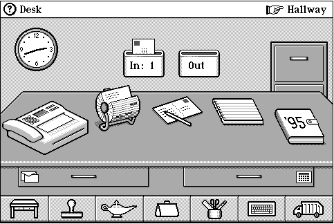
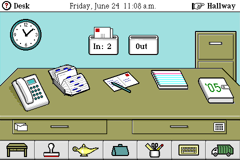
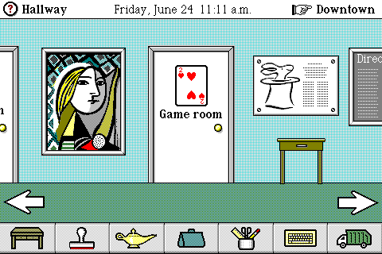

# Magic Cap / Sony Magic Link

Базовый референс: интерфейс выглядит как настоящий письменный стол. Телефон, лотки входящей и исходящей почты, бумага, блокнот, календарь и ящики — предметы внутри сцены, а не ряд абстрактных иконок. Указатель Hallway связывает стол с пространством за пределами комнаты.

## Изображения

- `magic-link-interface.png` — иллюстрация интерфейса из [предложенной статьи о Sony Magic Link PIC-1000](https://pikabu.ru/story/vzglyad_v_proshloe_sony_magic_link_pic1000_4292534). Статья — вторичный источник; версия системы на самой иллюстрации не указана. [Оригинал изображения](https://cs4.pikabu.ru/post_img/2016/06/23/11/1466710101188059037.png).

- `desk-windows.png` и `corridor-windows.png` — **Magic Cap for Windows, pre-release**, согласно [GUIdebook](https://guidebookgallery.org/guis/magiccap/screenshots/). Это не снимки экрана Sony Magic Link: полезны как отдельная версия того же визуального языка.
- Оригиналы: [стол](https://guidebookgallery.org/pics/gui/extra/magiccap/desk.png), [коридор](https://guidebookgallery.org/pics/gui/extra/magiccap/corridor.png).

## Что взять в дизайн

- Один общий ракурс стола: сразу видно расположение инструментов.
- Функциональная метафора предмета: телефон для связи, лоток для писем, календарь для дат.
- Четыре тона серого, чёткий контур, штриховка и минимум декоративных материалов.
- Переход «стол → коридор» как пространственная навигация.

Изображения сохранены для исследования и сравнения. Права принадлежат соответствующим правообладателям; наличие файла здесь не означает разрешение использовать его в продукте. Источники просмотрены 2026-10-10.
