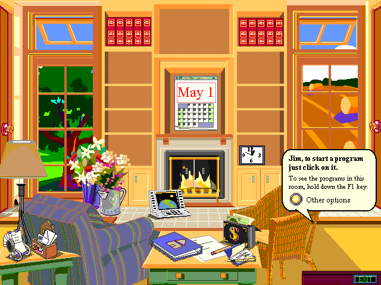

# Microsoft Bob — комната как интерфейс

Близкий референс к Magic Cap: не обычный набор окон, а иллюстрированная домашняя комната с предметами для запуска программ. Это линия скевоморфных интерфейсов 1990-х, а не поздний физический 3D-десктоп.

## Что изображено и зачем смотреть

`main-room.png` — главная комната дома Microsoft Bob, так её подписывает GUIdebook. Видны журнальный стол с бумагами и книгой, телефон, календарь, часы, кресло и камин; подсказка предлагает нажать на предмет, чтобы запустить программу. Для дизайна полезны плотность небольших бытовых объектов, перспектива стола на переднем плане, тёплая палитра и превращение узнаваемого предмета в элемент навигации. Это визуальный анализ сохранённого изображения, не утверждение, что любой предмет в комнате интерактивен.

## Источники

- [GUIdebook: скриншоты Microsoft Bob](https://guidebookgallery.org/guis/bob/screenshots/) — историческая галерея Marcin Wichary; источник изображения и его подписи.
- Прямой URL сохранённого изображения: https://guidebookgallery.org/pics/gui/extra/bob/clock.png
- [Оригинальная реклама Microsoft Bob из Wired, июнь 1995, сохранённая GUIdebook](https://guidebookgallery.org/ads/magazines/bob/comfortable/) — первичный рекламный материал. Перечисляет письма, календарь, адреса, электронную почту, программы Windows и анимированных помощников; рекламные оценки удобства не принимаются здесь за независимые факты.
- [Обзор Microsoft Bob](https://en.wikipedia.org/wiki/Microsoft_Bob) — вторичный источник для контекста метафоры дома и выпуска в 1995 году.

## Локальный файл и права

Изображение скачано напрямую, без установочных архивов: PNG, 640 × 480. Скриншот сохранён без редактирования. Проверены формат файла и открытие изображения.

Интерфейс — Microsoft; в галерее указано © 2002–2006 Marcin Wichary, если не оговорено иначе. Свободная лицензия на этот скриншот не установлена. Это материал для изучения визуальных решений, не набор графики, разрешённой для переноса в собственный продукт; условия публикации и повторного использования следует проверять отдельно.
